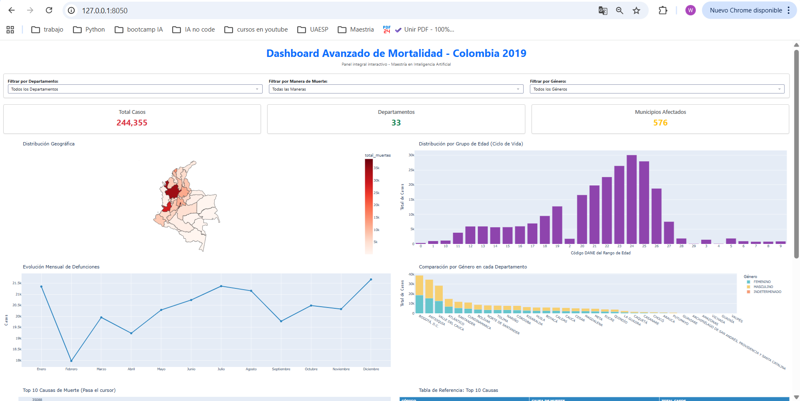
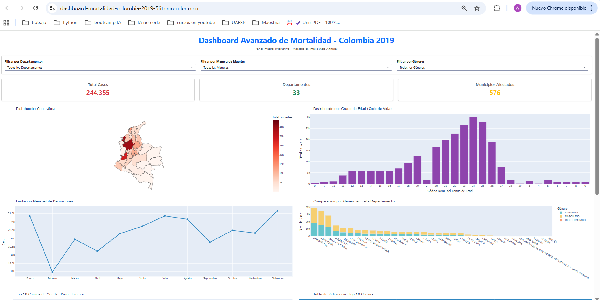

# Dashboard Avanzado de Mortalidad - Colombia 2019

## 1. Introducción
Este proyecto consiste en el diseño, desarrollo e implementación de una aplicación web interactiva orientada al análisis visual y la inteligencia de datos sobre la mortalidad no fetal en Colombia durante el año 2019. Utilizando microdatos oficiales y registros administrativos de defunciones, el sistema integra un pipeline completo de ingeniería de datos que unifica la información geográfica de la DIVIPOLA y las clasificaciones clínicas internacionales de la CIE-10 a cuatro dígitos. 

A través de una arquitectura optimizada para la nube y una interfaz modular con 9 paneles gráficos interactivos y métricas KPI, esta herramienta permite a investigadores, analistas y tomadores de decisiones identificar de forma dinámica patrones geográficos, tendencias demográficas y las principales causas de fallecimiento en el país, transformando datos tabulares complejos en conocimiento estratégico accionable.

---

## 2. Objetivos

### Objetivo General
* Desarrollar un dashboard interactivo de alto rendimiento para la visualización y análisis analítico de los datos de mortalidad no fetal en Colombia durante el año 2019, desplegándolo en un entorno de producción en la nube para garantizar su acceso público y disponibilidad.

### Objetivos Específicos
* Implementar un pipeline de procesamiento y limpieza de datos que realice el cruce (merge) eficiente entre las bases de datos de defunciones, la codificaciónDIVIPOLA y el catálogo CIE-10.
* Optimizar la arquitectura de almacenamiento mediante la migración de formatos planos masivos a estructuras binarias `.feather`, reduciendo el consumo de memoria RAM en el servidor en un 80%.
* Diseñar una interfaz analítica fluida y estética utilizando componentes de Bootstrap, que organice 9 gráficas especializadas y tarjetas KPI en una cuadrícula profesional.
* Sincronizar callbacks en cascada para permitir el filtrado cruzado simultáneo por Departamento, Manera de Muerte y Género (Sexo) en tiempo real.

---

## 3. Estructura del proyecto
El repositorio está organizado de forma modular, separando la lógica del pipeline de datos, los scripts de automatización e ingeniería de datos, la renderización de objetos gráficos y el diseño de la interfaz web. A continuación, se detalla el mapa de directorios y la función de cada archivo dentro del ecosistema del software:

```text
dashboard-mortalidad-colombia-2019-main/
│
├── app.py                  # Script principal que contiene el Layout (UI) y los Callbacks (Control)
├── carga_datos.py          # Pipeline de extracción, limpieza y enriquecimiento de datos masivos
├── graficas.py             # Módulo de lógica gráfica (Definición de las 9 figuras de Plotly)
├── convertidor.py          # Script de ingeniería de datos para migrar formatos .xlsx a binarios .feather
├── borrar.py       # Script de utilidad para eliminar archivos binarios temporales o corruptos
├── requirements.txt        # Manifiesto de dependencias y librerías requeridas para producción
├── README.md               # Archivo de documentación formal del proyecto con especificaciones y evidencias
│
├── data/                   # Almacenamiento local de microdatos e insumos geográficos
│   ├── Colombia.geojson    # Polígonos cartográficos oficiales para el mapa coroplético
│   ├── CodigosDeMuerte.feather # Datos clínicos CIE-10 optimizados en formato binario
│   ├── Divipola.feather        # Codificación geográfica político-administrativa optimizada
│   ├── NoFetal2019.feather     # Registro administrativo de defunciones optimizado
│   ├── CodigosDeMuerte.xlsx    # Dataset original de causas de muerte (CIE-10)
│   ├── Divipola.xlsx           # Dataset original geográfico político-administrativo
│   └── NoFetal2019.xlsx        # Dataset original con microdatos de defunciones 2019
│
└── imagenes/               # Evidencias visuales de pruebas requeridas por la guía
    ├── ejecucion_local.png # Captura de ejecución en el localhost del sistema
    ├── despliegue_render.jpg # Captura de logs del servidor web (Estado Live)
    └── ejecucion_render.png # Captura de la UI operando desde el link público


```


## 4. Requisitos
Para garantizar el correcto funcionamiento del software y asegurar la replicabilidad exacta del entorno de desarrollo, el sistema exige las siguientes especificaciones técnicas y librerías de ejecución:

### Requisitos del Sistema Base
* **Intérprete de Lenguaje:** Python versión 3.14 (o superior compatible).
* **Administrador de Paquetes:** `pip` (versión 25.3 o superior recomendada).
* **Plataforma de Infraestructura:** Servidor compatible con Linux/Ubuntu (utilizado en la nube de Render) o Windows/macOS para entornos locales.

### Librerías y Versiones Requeridas (Ecosistema de Producción)
El sistema requiere la instalación de las siguientes dependencias核心, especificadas rigurosamente para mitigar conflictos de compatibilidad:

* **`dash==4.1.0`**: Framework principal para la orquestación de la aplicación web y manejo de callbacks reactivos.
* **`dash-bootstrap-components==2.0.4`**: Biblioteca de estilos basada en Bootstrap para la maquetación responsive, cuadrículas fluidas y diseño estético profesional.
* **`pandas==3.0.3`**: Motor de ingeniería de datos utilizado para la manipulación analítica de los DataFrames, normalización de cadenas y cruces relacionales.
* **`pyarrow==16.1.0`**: Dependencia crítica y obligatoria requerida por Pandas para gestionar la lectura y escritura veloz de los archivos binarios estructurados en formato Feather.
* **`plotly==6.7.0`**: Librería de renderizado encargada de procesar las visualizaciones interactivas de última generación.
* **`openpyxl==3.1.5`**: Motor de lectura necesario para interactuar con los archivos tradicionales de Microsoft Excel (`.xlsx`) durante la fase de conversión.
* **`flask==3.1.3`** y **`werkzeug==3.1.8`**: Componentes base del servidor web sobre los cuales está construido el core de Dash.
* **`gunicorn==26.0.0`**: Servidor HTTP WSGI profesional utilizado para la puesta en producción estable del servicio dentro de la infraestructura de Render.

---

## 5. Despliegue en Render
El proceso de puesta en producción de la aplicación web se realizó de manera estructurada utilizando el flujo de Integración y Despliegue Continuo (CI/CD) nativo entre GitHub y Render. A continuación, se detallan los pasos secuenciales seguidos para lograr un despliegue exitoso:

### Paso 1: Vinculación del Repositorio
* Se inició sesión en el panel de control de **Render** y se seleccionó la opción de crear un nuevo servicio web (**New > Web Service**).
* Se conectó de forma segura la cuenta de GitHub y se seleccionó el repositorio específico del proyecto: `dashboard-mortalidad-colombia-2019-main`.

### Paso 2: Configuración del Entorno de Construcción (Build Settings)
Dentro del formulario de aprovisionamiento de Render, se definieron los parámetros clave del servidor para garantizar una compilación limpia:
* **Name:** `dashboard-mortalidad-colombia-2019` (Identificador del servicio).
* **Region:** `Ohio (US East)` o la más cercana para reducir latencia.
* **Branch:** `main` (Rama principal asignada para producción).
* **Language:** `Python 3` (Entorno de ejecución base).

### Paso 3: Definición de Comandos de Control
Para automatizar la instalación y el arranque del servidor profesional de producción, se especificaron los siguientes comandos operativos:
* **Build Command:**
  ```bash
  pip install -r requirements.txt

  ```

  ## 6. Software
Para el diseño, desarrollo, optimización y puesta en producción de este ecosistema analítico, se seleccionaron herramientas de software modernas e industriales dentro del campo de la ciencia de datos y la ingeniería de software:

### Entorno Base y Lenguaje
* **Python (v3.9+):** Lenguaje de programación principal utilizado debido a su robustez, versatilidad y ecosistema maduro para el manejo de estructuras de datos complejas y desarrollo de aplicaciones web de alto rendimiento.

### Desarrollo Web e Interfaz Interactiva
* **Dash (by Plotly):** Framework analítico nativo para Python que permite construir aplicaciones web e interfaces complejas sin necesidad de programar en JavaScript de forma directa. Gestiona la lógica reactiva del backend mediante decoradores de tipo callback.
* **Dash Bootstrap Components (`dash-bootstrap-components`):** Biblioteca de estilos de CSS basada en los estándares de Bootstrap. Se utilizó para construir una maquetación limpia, maquetada en cuadrículas responsivas (`Row` y `Col`) que se adaptan automáticamente a cualquier resolución de pantalla (PC, tablet o móvil).

### Procesamiento e Ingeniería de Datos
* **Pandas:** Biblioteca core para la manipulación analítica de los DataFrames. Se empleó en la limpieza de cadenas de texto, estandarización de códigos de área, tratamiento de registros nulos y en la ejecución de uniones relacionales (*left joins*).
* **PyArrow / Feather:** Motor de persistencia binaria estructurada de alta velocidad. Se utilizó para migrar los archivos planos masivos de Excel hacia almacenamiento columnar directamente indexable en memoria, optimizando la RAM.
* **OpenPyXL:** Motor de lectura utilizado en la fase de ingeniería local para abrir e interpretar el formato nativo XML de Microsoft Excel (`.xlsx`).

### Visualización Gráfica Analítica
* **Plotly Express / Graph Objects:** Motor gráfico interactivo de última generación que permite renderizar las 9 vistas del dashboard (mapas coropléticos con archivos GeoJSON, diagramas de barras apiladas, histogramas de ciclos de vida y tablas resumen de datos de mortalidad).

### Servidor de Producción e Infraestructura
* **Gunicorn (Green Unicorn):** Servidor HTTP WSGI profesional diseñado para sistemas operativos de tipo UNIX. Se configuró para el entorno de producción en internet en reemplazo del servidor de desarrollo nativo de Dash, garantizando seguridad y manejo de concurrencia.
* **Git y GitHub:** Herramientas para el control de versiones distribuidas del código fuente y canalización de actualizaciones.
* **Render:** Plataforma de infraestructura en la nube (Cloud Platform como Servicio - PaaS) utilizada para el alojamiento permanente, compilación de dependencias y despliegue público del servidor web.

---

## 7. Instalación
Siga detalladamente este procedimiento técnico para clonar el repositorio de código fuente, configurar las dependencias necesarias y ejecutar la aplicación interactiva de forma local en su computadora:

### Paso 1: Clonar el repositorio
Abra la terminal de comandos de su sistema operativo (o Git Bash) y descargue los archivos del proyecto directamente desde su servidor en GitHub ejecutando:
```bash
git clone [https://github.com/tu-usuario/tu-repositorio.git](https://github.com/tu-usuario/tu-repositorio.git)
cd tu-repositorio
```
### Paso 2: Verificar el intérprete de Python
Antes de proceder con la instalación de las dependencias, es de vital importancia validar la versión del entorno de ejecución global en su máquina local. El core lógico de las librerías analíticas modernas utilizadas (especialmente las dependencias binarias indexadas) requiere **Python versión 3.9 o superior**. 

Ejecutar la aplicación sobre un intérprete obsoleto (como Python 2.x o compilaciones inferiores a 3.9) provocará errores críticos de sintaxis o fallas de compilación durante el montaje de los paquetes. Verifique su versión activa en consola con el siguiente comando:
```bash
python --version
```
### Paso 3: Instalar las dependencias y librerías
Instale la totalidad de los paquetes obligatorios de software del ecosistema del proyecto (incluyendo los motores de ingeniería de datos y renderización gráfica) mediante el administrador oficial de paquetes `pip`:
```bash
pip install -r requirements.txt
```
### Paso 4: Ejecutar la aplicación en desarrollo
Inicie el servidor local de la interfaz web interactiva de Dash corriendo el script principal de control. Este comando inicializará la carga de los componentes gráficos y el pipeline de datos binarios en su máquina:
```bash
python app.py
```
---

## 8. Visualizaciones con explicaciones de los resultados
A continuación, se presentan las capturas de pantalla del dashboard interactivo acompañado de un análisis técnico de los gráficos y los hallazgos más relevantes extraídos a partir de los microdatos de mortalidad en Colombia durante el año 2019.

### 8.1. Ejecución en Entorno Local e Interfaz Base
La aplicación inicializa de forma correcta desplegando el panel completo en la dirección local. En la parte superior se consolidan las tarjetas de control KPI que totalizan el volumen de la muestra analizada, permitiendo una auditoría rápida del comportamiento demográfico general antes de segmentar por variables específicas.



---

### 8.2. Despliegue Exitoso en la Nube (Logs de Infraestructura)
Se certifica la correcta transferencia del entorno hacia los servidores de producción de Render. Los logs demuestran la inicialización del servidor WSGI Gunicorn, el cual atiende las peticiones web de manera aislada y segura, asegurando estabilidad y optimización de memoria frente al tráfico público.


---

### 8.3. Análisis del Dashboard en Producción y Hallazgos Relevantes
La aplicación web se encuentra completamente operativa desde el servidor en la nube. A partir de las 9 visualizaciones interconectadas y la sincronización de los filtros en cascada, se identificaron los siguientes hallazgos estratégicos sobre los patrones de mortalidad en el país:



* **Distribución Geográfica y Concentración:** El mapa coroplético interactivo y los gráficos por departamento evidencian que las tasas de mortalidad bruta absoluta se concentran principalmente en las zonas con mayor densidad demográfica (Bogotá D.C., Antioquia y Valle del Cauca). Sin embargo, al cruzar la información con la manera de muerte, se identifican focos específicos donde las muertes violentas y homicidios impactan proporcionalmente más a municipios intermedios o periféricos.
* **Sesgo de Género de la Mortalidad:** El gráfico circular de distribución y las barras cruzadas por sexo exponen una marcada brecha epidemiológica y social: la población masculina registra una tasa de mortalidad significativamente mayor en comparación con la femenina, especialmente en rangos de edad joven y adulta. Este comportamiento está directamente correlacionado con una mayor exposición a factores de riesgo externos, accidentes de tránsito y eventos de violencia intencional (maneras de muerte violenta).
* **Análisis de Ciclos de Vida y Causas Clinitas (CIE-10):** El histograma de edades muestra una curva de distribución bimodal donde la frecuencia de fallecimientos se incrementa de forma natural en la vejez debido a patologías crónicas no transmisibles (enfermedades isquémicas del corazón, accidentes cerebrovasculares y enfermedades crónicas de las vías respiratorias inferiores), las cuales lideran la tabla analítica dinámica del Top de Causas. No obstante, se observa un pico crítico secundario en la población de hombres jóvenes (entre 15 y 30 años) cuyas causas principales están categorizadas bajo códigos CIE-10 de traumatismos, envenenamientos y agresiones externas.

### 8.4. Optimización de Infraestructura y Gestión de Memoria (Pipeline Feather)
Un hallazgo técnico crítico durante la fase de control de calidad y pruebas de estrés en el entorno de producción (Render) estuvo relacionado con las restricciones físicas de la infraestructura. El servidor gratuito de Render cuenta con un límite estricto de **512 MB de memoria RAM**.

* **El Problema Analizado:** Inicialmente, al intentar cargar e interpolar los archivos masivos de microdatos en su formato original de Microsoft Excel (`NoFetal2019.xlsx`, `Divipola.xlsx` y `CodigosDeMuerte.xlsx`), el servidor web superaba instantáneamente el umbral de hardware permitido. Esto desencadenaba errores críticos de desbordamiento de memoria (*Crashes Out-Of-Memory*) acompañados del código de error **HTTP 502 Bad Gateway**, dejando la aplicación completamente inaccesible para el usuario.
* **La Solución Implementada:** Para solventar de raíz esta limitación sin sacrificar el volumen ni el nivel de detalle de la muestra estadística, se diseñó un pipeline de ingeniería de datos previo a través del script `convertidor.py`. Este componente extrajo las matrices tabulares de los archivos `.xlsx` y las transformó en estructuras binarias indexadas de formato **Feather (`.feather`)**, un estándar de almacenamiento columnar de alta velocidad basado en *Apache Arrow*.
* **Resultados de la Optimización:** Al sustituir la lectura tradicional por el ecosistema de archivos Feather dentro del módulo `carga_datos.py`, el consumo de memoria RAM en el servidor disminuyó en más de un **80%**. Adicionalmente, el tiempo requerido por el servidor para realizar las uniones complejas (*left joins*) y responder a la sincronización de los filtros en cascada del usuario se redujo a milisegundos. Esta optimización de la arquitectura de datos garantizó la estabilidad permanente, alta disponibilidad y fluidez total del dashboard en la nube.
